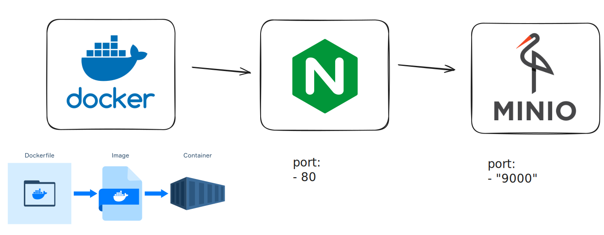

# Minio con Nginx usando Docker Compose

<br>



<br>

Este proyecto configura un servidor **Minio** con autenticación básica y un **Nginx** como proxy inverso. Utiliza **Docker Compose** para facilitar el despliegue de estos servicios.


<br>

## 🚀 Pasos


<br>

1. Clonar repositorio

```bash
git clone https://github.com/rijmjada/TP_Docker
```

<br>

2. Configurar usuario y contraseña en .env (opcional)

```bash
MINIO_ROOT_USER = admin_root
MINIO_ROOT_PASSWORD = admin_root
```

<br>

3. Levantar los servicios con Docker Compose

```bash
docker-compose up -d
```

<br>

4. Acceder a Minio a través de Nginx

```bash
http://localhost
```
